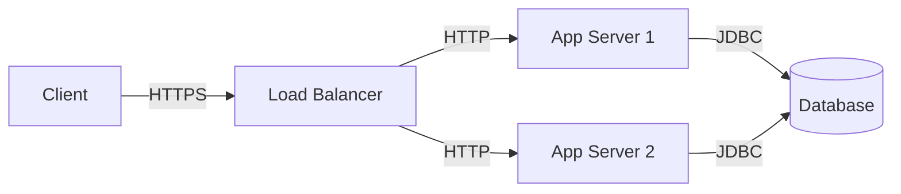

# Application Architecture

## Overview

The Employee Management System follows a layered architecture pattern with clear separation of concerns. The application is built using Spring Boot and follows best practices for enterprise applications.

## Architecture Diagram

```mermaid
graph TD
    Client[Client Layer] --> |HTTP| API[API Layer]
    API --> |Security| Auth[Authentication Layer]
    Auth --> |Authorization| Service[Service Layer]
    Service --> |Persistence| Repository[Repository Layer]
    Repository --> |Data Access| DB[(Database)]
    
    subgraph "API Layer"
        Controller[Controllers]
        DTO[DTOs]
        Exception[Exception Handlers]
    end
    
    subgraph "Service Layer"
        ServiceImpl[Service Implementations]
        Security[Security Service]
        Email[Email Service]
        Payroll[Payroll Service]
    end
    
    subgraph "Repository Layer"
        JPA[JPA Repositories]
        Flyway[Flyway Migrations]
    end
```

## Layer Descriptions

### 1. Client Layer
- Web browsers
- Mobile applications
- API clients
- Swagger UI for API documentation

### 2. API Layer
- REST Controllers
- Request/Response DTOs
- Exception handling
- Input validation
- API documentation (Swagger)

### 3. Authentication Layer
- JWT token management
- Role-based access control
- Security filters
- Password encryption

### 4. Service Layer
- Business logic implementation
- Transaction management
- Email notifications
- Payroll calculations
- Security services

### 5. Repository Layer
- Data access
- Database migrations
- Entity management
- Query optimization

## Key Components

### Security
- Spring Security for authentication
- JWT for stateless sessions
- BCrypt for password encryption
- Role-based access control

### Data Access
- Spring Data JPA
- PostgreSQL database
- Flyway for migrations
- Optimistic locking

### Business Logic
- Service layer for business rules
- Transaction management
- Event handling
- Email notifications

### API Design
- RESTful endpoints
- DTO pattern
- Input validation
- Error handling

## Design Patterns

1. **Repository Pattern**
   - Abstracts data access
   - Provides type-safe queries
   - Simplifies testing

2. **Service Layer Pattern**
   - Encapsulates business logic
   - Manages transactions
   - Coordinates between repositories

3. **DTO Pattern**
   - Separates API from domain models
   - Controls data exposure
   - Validates input

4. **Factory Pattern**
   - Creates complex objects
   - Manages object lifecycle
   - Reduces coupling

5. **Strategy Pattern**
   - Implements different algorithms
   - Swaps implementations
   - Extends functionality

## Security Architecture

1. **Authentication**
   - JWT-based authentication
   - Token refresh mechanism
   - Password reset flow

2. **Authorization**
   - Role-based access control
   - Method-level security
   - Resource-level security

3. **Data Protection**
   - Password encryption
   - Input validation
   - SQL injection prevention

## Deployment Architecture

- Load balanced application servers
- Single database instance
- Shared file storage
- Redis for caching 