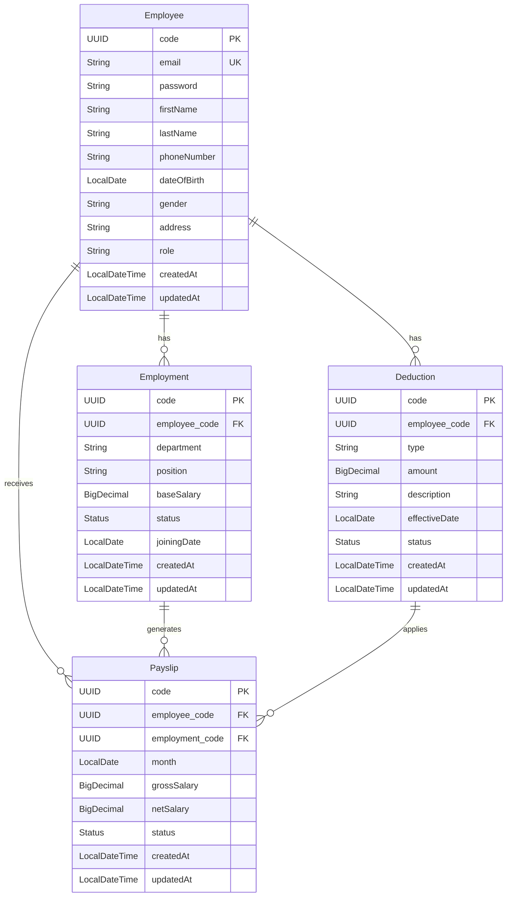

# Database ERD Schema

## Entity Relationships

## Entity Descriptions

### Employee
- Primary entity representing system users
- Contains personal and authentication information
- Has role-based access control (ADMIN, MANAGER, EMPLOYEE)
- One-to-many relationships with Employment, Payslip, and Deduction

### Employment
- Represents employment history of employees
- Tracks department, position, and salary information
- One-to-many relationship with Payslip
- Many-to-one relationship with Employee

### Payslip
- Represents monthly salary payments
- Calculates gross and net salary
- Includes all applicable deductions
- Many-to-one relationships with Employee and Employment
- One-to-many relationship with Deduction

### Deduction
- Represents salary deductions (tax, insurance, etc.)
- Can be one-time or recurring
- Many-to-one relationship with Employee
- One-to-many relationship with Payslip

## Key Features

1. **UUID Primary Keys**
   - All entities use UUID for primary keys
   - Ensures global uniqueness
   - Better for distributed systems

2. **Audit Fields**
   - All entities include createdAt and updatedAt
   - Tracks creation and modification times
   - Helps with auditing and debugging

3. **Status Tracking**
   - Employment, Payslip, and Deduction have status fields
   - Tracks active/inactive states
   - Helps with business logic implementation

4. **Foreign Key Relationships**
   - All relationships are properly defined
   - Ensures data integrity
   - Enables efficient querying

5. **Indexing**
   - Email is unique indexed
   - Foreign keys are indexed
   - Optimizes query performance